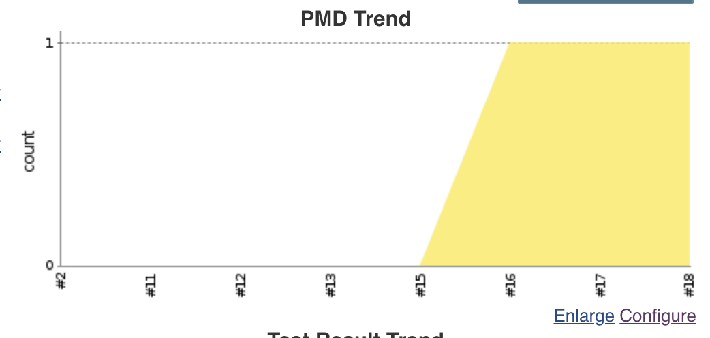
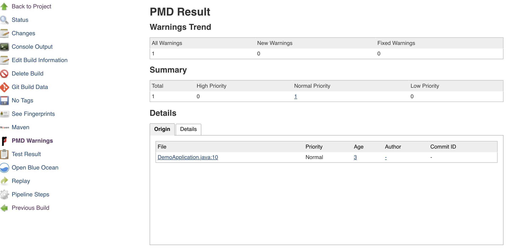
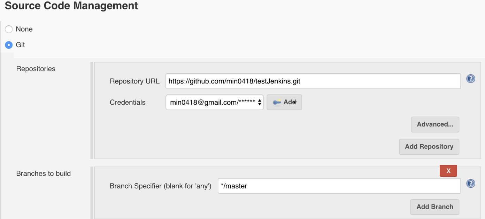
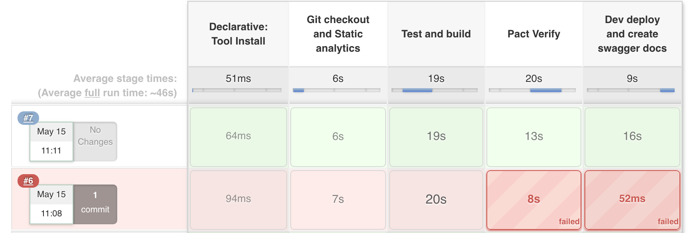
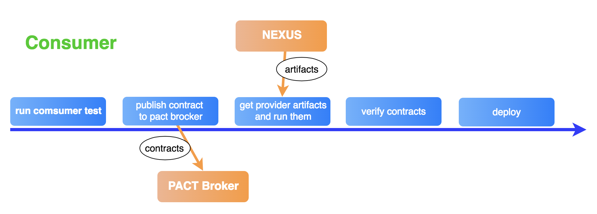

# CI/CD \(Continuous Integration and Continuous Delivery\)

jenkins를 활용한 CICD구성에 대하여 설명한다.

## 1. Jenkins Plugins

### Build monitor

빌드 상태를 모니터링 할 수 있는 뷰를 제공한다.  
[Learn more](https://wiki.jenkins.io/display/JENKINS/Build+Monitor+Plugin)


### PMD

PMD 수행 결과 보고서 조회 및 트랜드 챠트를 조회 할 수 있다.  
[Learn more](https://wiki.jenkins.io/display/JENKINS/PMD+Plugin)

\[PMD Trend\]  


\[PMD Result\]  


* 설정 방법  

  Jenkiks &gt; Job &gt; configure &gt; Post-build Actions에서 Publish PMD analysis results 항목에 결과 파일명 지정

### FindBugs

FindBugs 수행 결과 보고서 조회 및 트랜드 챠트를 조회 할 수 있다.  
[Learn more](https://wiki.jenkins.io/display/JENKINS/FindBugs+Plugin)

* 설정 방법  

  Jenkiks &gt; Job &gt; configure &gt; Post-build Actions에서 Publish FindBugs analysis results 항목에 결과 파일명 지정

### Slack

빌드 결과를 slack으로 전송할 수 있다.  
[Learn more](https://wiki.jenkins.io/display/JENKINS/Slack+Plugin)

### Blue Ocean

젠킨스의 개선된 UI를 사용가능하고, Pipeline을 단계별로 구성 할 수 있는 도구를 제공한다.  
[Learn more](https://jenkins.io/projects/blueocean/)

## 2. Git Webhook

Git 에서의 작업 조건을 트리거로 해서 빌드를 수행 한다.

* 설정 방법  
  \[Github\]  
  

  \[Jenkins\]  
  

  

## 3. Pipeline

젠킨스를 이용한 빌드파이프라인 구성이 가능하다.  
각자의 프로젝트 상황에 맞는 단계로 파이프 라인을 구성 한다.

\(아래는 5개의 단계로 구성된 파이프라인 script 예시를 사용한다.\) 

* Declarative: Tool install 빌드에 사용 될 Tool 지정
* Git checkout and Static analytics Source 체크아웃 및 정적 분석 실행
* Test and build Test와 build 실행
* Pact verify Contract Test 수행\(Pact Broker사용\)
* Dev deploy and create swagger docs artifact를 배포 하고 API 관련 문서를 생성

> Pipeline 스크립트는 아래 메뉴에서 참고하고 생성 가능  
> Jenkins &gt; job &gt; pipeline syntext
>
> 프로젝트 내에 Jenkinsfile 이라는 이름으로 스크립트 생성하여 사용할 수도 있다.

```text
    pipeline {
       tools{
           maven "M3"
       }
       agent any
       stages{
         stage('Git checkout and Static analytics') {
             steps{
                 checkout([$class: 'GitSCM', branches: [[name: '*/master']], doGenerateSubmoduleConfigurations: false, extensions: [], submoduleCfg: [], userRemoteConfigs: [[credentialsId: 'bfb6f0b7-256b-47a1-88bf-f33dd42eb0fb', url: 'https://github.com/SDSACT/microservice-coe-order-service.git']]])
                 checkout changelog: false, poll: false, scm: [$class: 'GitSCM', branches: [[name: '*/master']], doGenerateSubmoduleConfigurations: false, extensions: [], submoduleCfg: [], userRemoteConfigs: [[credentialsId: 'testmin0418', url: 'https://github.com/SDSACT/microservice-coe-order-service.git']]]

                 script {
                      if(params.pmdYn){
                          sh "mvn pmd:pmd"
                          pmd canComputeNew: false, defaultEncoding: '', healthy: '', pattern: 'target/pmd.xml', unHealthy: ''
                      }
                 }
             }

         }

         stage('Test and build'){
             steps{
                 script{
                     if(params.unitTestYn){
                          sh "mvn -Dtest=**/unit/**/* -DfailIfNoTests=false test"  

                     }
                     if (params.functionalTestYn) {
                         sh "mvn -Dtest=**/functional/**/* -DfailIfNoTests=false test"
                     }
                     sh "mvn -Dtest=**/contract/**/* -DfailIfNoTests=false test"
                     sh "mvn pact:publish"
                      junit '**/target/surefire-reports/TEST-*.xml'
                      sh "mvn clean install -DskipTests=true"
                 }
             }

         }
         stage('Pact Verify') {
             steps {
                 sh 'curl -o customer-service.jar  -u admin:admin123 -L "http://localhost:8081/nexus/service/local/artifact/maven/redirect?r=coe&g=org.coe.msa&a=customer-service&v=0.0.1&p=jar"'
                 sh 'nohup java -Dserver.port=10000 -jar customer-service.jar &'
                  waitUntil {
                     script {
                       def r = sh script: 'curl http://localhost:10000', returnStatus: true
                       return (r == 0);
                     }
                  }
                 sh 'mvn pact:verify'
             }
         }
         stage('Dev deploy and create swagger docs') {
             steps {
                 sh 'scp -i $KEY_PATH ./target/order-service-0.0.1-SNAPSHOT.jar /Users/santiago/runscript.sh  actmember@192.168.30.129:/Users/actmember/microservice-coe'
                 sh 'nohup ssh -i /Users/santiago/.ssh/oslo.key actmember@192.168.30.129 "cd /Users/actmember/microservice-coe/ && ./runscript.sh restart order-service-0.0.1-SNAPSHOT.jar 9997" &'
                 waitUntil {
                     script {
                       def r = sh script: 'curl http://192.168.30.129:9997', returnStatus: true
                       return (r == 0);
                     }
                  }
                  sh 'curl -sb -H "Accept: application/json" "http://192.168.30.129:9997/v2/api-docs" > /Users/santiago/microservice-coe-ci/swagger-json/order-api-docs.json'
                  sh 'cd /Users/santiago/microservice-coe-ci/swaggregator && /Users/santiago/.nvm/versions/node/v6.14.1/bin/node swaggregator.js'
                  sh 'cp /Users/santiago/microservice-coe-ci/swaggregator/dist/aggregated.json /Users/santiago/microservice-coe-ci/swagger-ui/dist'
             }
         }
       }
     }
```

## 4. Pact\(Contract Test\) / Nexus / Pact Broker

Client Driven Test 로서 Client가 필요로 하는 API 항목에 대하여 Contract\(Pact\)를 생성하고, 이에 대한 Provider의 적합 여부를 Test 한다.




## 5. Ansible

원격지 서버에 대하여 서비스 설치, 패키지 배포 등의 작업을 수행한다.  
한번 정의 된 작업에 대하여 재사용이 용이하다.

### 대상 호스트 정의

/etc/ansible/hosts

```text
mail.example.com  

[webservers]  
foo.example.com  
bar.example.com  

[dbservers]  
one.example.com  
two.example.com  
three.example.com
```

### Play book\(작업들이 정의 된 파일\)

```text
- hosts: webservers
  vars:
    http_port: 80
    max_clients: 200
  remote_user: root
  tasks:
  - name: ensure apache is at the latest version
    yum: name=httpd state=latest
  - name: write the apache config file
    template: src=/srv/httpd.j2 dest=/etc/httpd.conf
    notify:
    - restart apache
  - name: ensure apache is running (and enable it at boot)
    service: name=httpd state=started enabled=yes
  handlers:
    - name: restart apache
      service: name=httpd state=restarted
```

### Ansible Galaxy

Palybooks portal

## 5. Maven deploy to Nexux

### maven help plugin

maven help plugin을 사용하여 pom.xml에 정의 된 artifact 정보 사용 가능 [자세히](https://maven.apache.org/plugins/maven-help-plugin/)

```markup
<plugin>
  <groupId>org.apache.maven.plugins</groupId>
  <artifactId>maven-help-plugin</artifactId>
</plugin>
```

mvn deploy 실행 예시  
\(Nexus 로그인 정보가 포함된 Global Maven 설정 파일이 MVN\_SETTING으로 jenkins에 등록되어 있어 있는 경우의 예시코드\)

```bash
A_ID=`mvn help:evaluate -Dexpression="project.artifactId" 2> /dev/null | grep -Ev '^\['`
A_VER=`mvn help:evaluate -Dexpression="project.version" 2> /dev/null | grep -Ev '^\['`
A_PACK=`mvn help:evaluate -Dexpression="project.packaging" 2> /dev/null | grep -Ev '^\['`
if ["$PUSH_IMAGE" = true];
then
  mvn deploy:deploy-file -DrepositoryId=nexus-release \
                         -DgeneratePom=false \
                         -Durl=http://nexusUrl/repository/dep-release-maven/ \
                         -DpomFile=pom.xml
                         -Dfile=target/${A_ID}-${A_VER}.${A_PACK} \
                         -s ${MVN_SETTING}
fi
```

