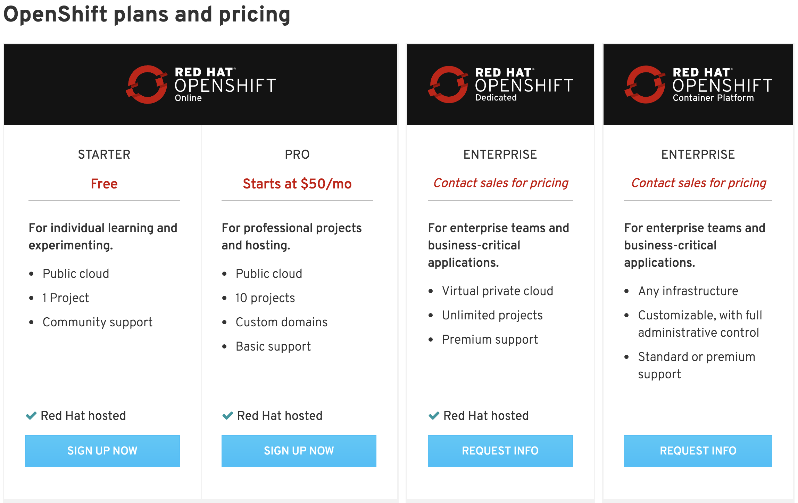
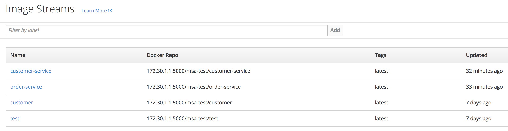
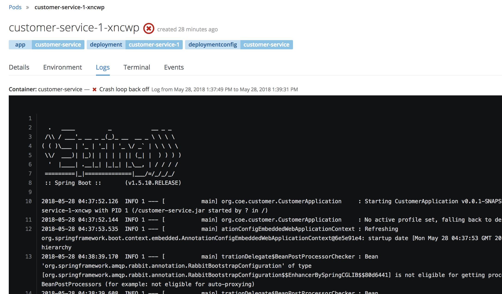
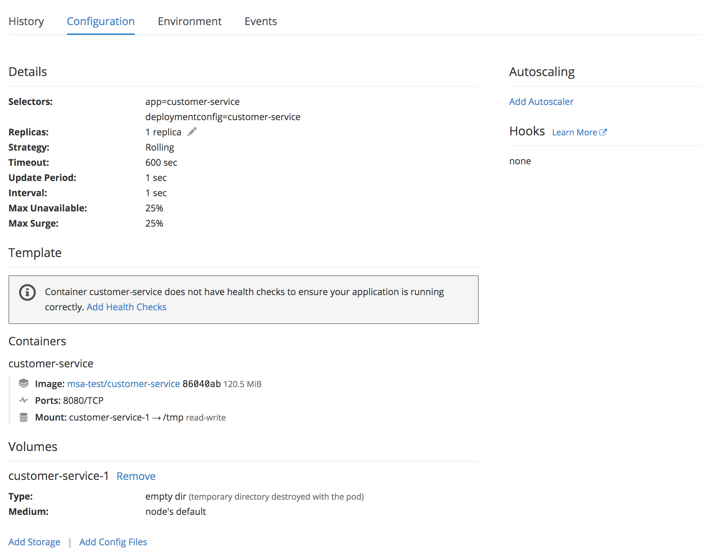
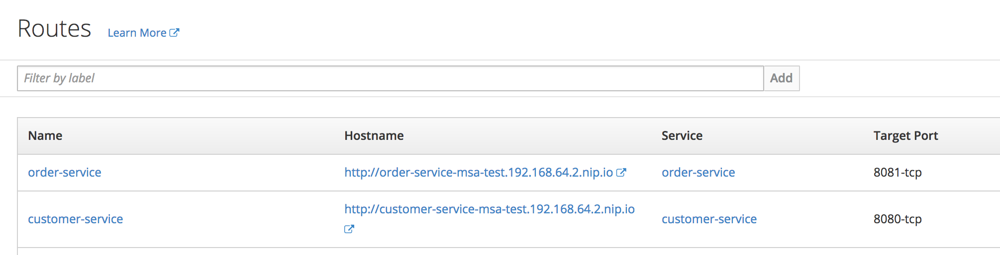

# Docker

## Docker 란?

## Kubernetes

## OpenShift

OpenShift는 컨테이너 애플리케이션 플랫폼으로서,  
컨테이너 관리 및 오케스트레이션을 위한 Docker와 Kubernetes의 기술을 포함

[출처 2018-05-28](https://www.openshift.com/products/pricing/)

## MiniShfit

### 내부 Docker

### Container 콘솔 로그 조회 및 터미널 접속 가능

### Autoscaling 및 replication

### 엔드포인트 라우팅 관리

rm /usr/local/bin/docker-credential-osxkeychain fixed it for me.

