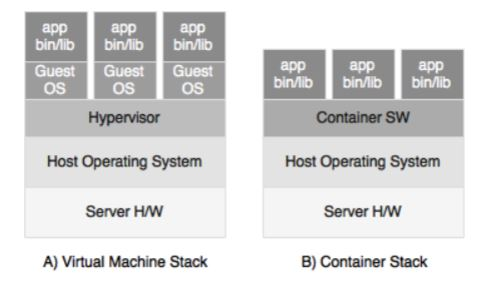
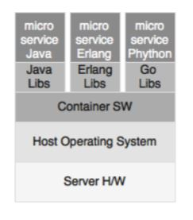

# 9장 도커 컨테이너와 마이크로서비스

## 1. 지금까지 만든 브라운필드 PSS 마이크로서비스의 한계 \(430p\)

* 클라우드 인프라스트럭쳐 미적용

  * 자동 프로비저닝
  * 수요에 따라 조절되는 확장성
  * 자율적인 서비스
  * 사용량 기반의 요금 지불

  하나의 가상머신이나 베어메탈 장비에 여러 개의 마이크로서비스를 배포 -&gt;  
   JRE, OS 수준 파라미터나 라이브러리 공유 -&gt;  
   마이크로서비스 원칙 위반 \(모두를 완전하게 캡슐화해서 자기완비적, 자율적\)

## 2. 컨테이너란 무엇인가? \(432p\)

* 운영체제 가상화 
* 운영체제 위에서 폐쇄적인 사적 공간을 제공
* 각각의 가상 공간을 컨테이너 또는 가상엔진이라고 부름 

### 실행 바이너리와 라이브러리를 함께 패키징 

* 자신만의 파일 시스템
* IP 주소
* 네트워크 인터페이스
* 내부 프로세스 
* 네임스페이스
* OS 라이브러리
* 애플리케이션 실행 바이너리 파일
* 필요한 의존 라이브러리와 애플리케이션 환경설정까지 모두 포함 가능

ex\) 도커, 엘엠시티파이, 시스템디앤스폰, 로켓, 드로우브리지, LXD, 쿠마, 칼리코

## 3. 가상머신과 컨테이너의 차이 \(433p\)

* 가상머신 
  * 게스트 OS라는 별도의 운영체제를 가진 고립된 유닛
  * 호스트 운영체제 환경에 전혀 의존하지 않는다 
    * 장점 - 완전히 고립된 환경 제공
    * 단점 - 무겁다. 하나의 장비에 얹을 수 있는 가상머신 수 제한적 
* 컨테이너
  * 호스트의 커널 및 운영체제의 일부분을 공유
  * 호스트 운영체제 위에서 고립된 실행 환경 제공
    * 장점 - 가볍고 빠르다. VM에 비해 많은 수의 컨테이너 실행 가능
    * 단점 - 운영 체제 공유하므로 제약 사항 \(IP 테이블 방화벽 규칙 설정 X\)

## 4. 컨테이너의 장점 \(436p\)

* 자기 완비적
* 경량성
* 확장성
* 이식성
* 저렴한 라이선스 비용 
* 데브옵스
* 버전관리
* 재사용성
* 불변 컨테이너

## 5. 마이크로서비스와 컨테이너

### 직접적으로 아무런 관련이 없으나 잘 어울린다

폴리글랏 마이크로서비스를 운영할 경우,

* 하나의 머신에서 다른 기술과 구조의 마이크로서비스들을 실행
* 같은 방식으로 배포
* 사용된 기술에 관계없이 컨테이너화된 마이크로서비스는 REST API를 제공

## 6. 도커

* 리눅스 커널 기반으로 가벼운 컨테이너를 만들고 탑재하고 실행할 수 있는 플랫폼
  * Boot2Docker를 사용해서 맥과 윈도우에서도 사용 가능
  * AWS EC2 컨테이너 서비스 제공
  * 전통적인 가상머신에도 설치 가능

### 도커 핵심 컴포넌트\(440p\)

* 도커 데몬 
  * 호스트 장비 위에 설치되는 서버 측 컴포넌트. 
  * 컨테이너를 만들고, 실행하고 배포하는 역할
* 도커 클라이언트 
  * 도커 데몬과 상호작용할 수 있는 CLI 프로그램.       

### 도커 주요 개념

* 도커 이미지 
  * 운영체제 라이브러리, 애플리케이션 및 의존 라이브러리의 읽기 전용 복사본
  * 도커 이미지는 계층형 아키텍처. 
  * 모든 계층을 하나의 이미지로 조립하고 단일 파일 시스템을 형성하기 위해 유니온 파일 시스템 개념이 적용
  * 중간의 모든 레이어는 캐시되어 변경사항이 없다면 이전에 캐시된 레이어를 사용\(변경된 레이어만 다시 빌드가능\)
  * 이미지 타입이 같은 다수의 컨테이너들은 기반 이미지 재사용 가능
* 도커 컨테이너 
  * 실행중인 도커 이미지의 인스턴스
* 도커 레지스트리
  * 도커 이미지를 퍼블리싱하고 다운로드할 수 있는 중앙 저장소
* 도커 파일 
  * 도커 이미지를 만들 수 있는 명령어를 포함하고 있는 빌드 파일 또는 스크립트

[https://subicura.com/2017/01/19/docker-guide-for-beginners-1.html](https://subicura.com/2017/01/19/docker-guide-for-beginners-1.html)

