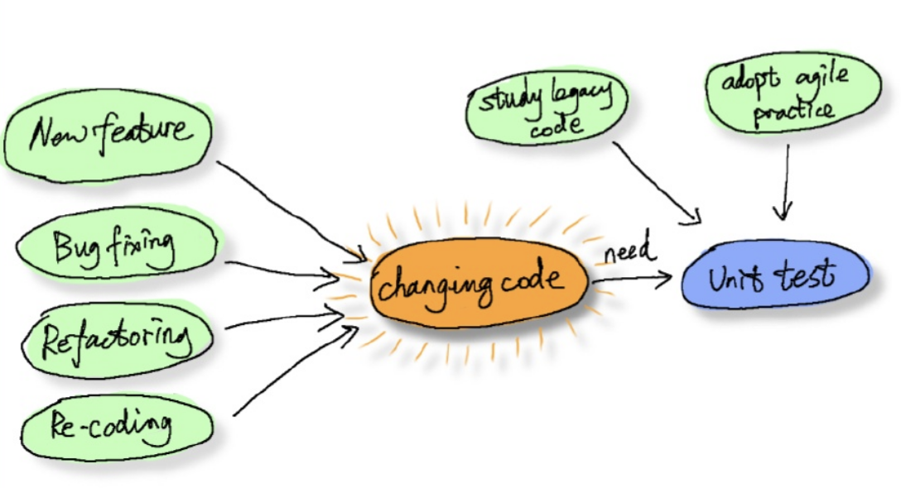
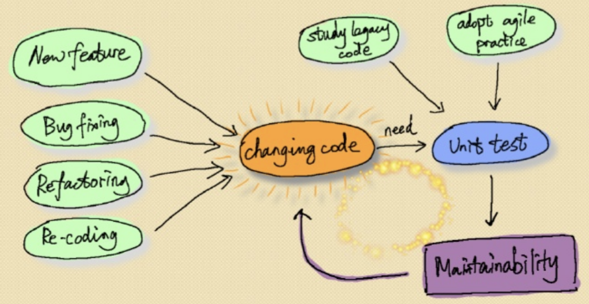

# Contents
- 배경
- Motivation
- 원칙
- 뭐부터 해야할까?
- 그래서 뭐가 좋은지?

### 배경
- 대규모 서비스
- 다년간 운영
- 많은 개발자
- 수 십, 수 백만 라인 이상의 전체 코드
- 수 천 라인 이상의 함수 코드
- 복잡한 로직 (예 : cyclomatic complexity > 50)

### Motivation

- 코드 변경을 위해서는 Unit Test가 필요하다
- 버그를 찾는 것이 목적이 아니다

### Unit Test 원칙 - F.I.R.S.T (Clean Code)
| 원칙 | 내용 |
|---|---|
|Fast|개발자가 언제든지 테스트할 수 있도록 빠르게 실행되어야 함|
|Isolated|실패의 원인이 명확하게 드러나도록 테스트 코드 작성|
|Repeatable|순서와 시간에 상관없이 실행 가능하게|
|Self-validating|테스트 성공/실패 여부 자동으로 확인|
|Timely|가능한 빨리 테스트 코드 작성, 100% 라인 커버리지가 목표 X|

###### 1. Keep it very simple, very stupid
- 테스트 케이스가 많을 수록 좋은 것은 아님 : 적은 것이 더 좋음
- 코드의 변경은 Unit Test가 존재할 때만 가능
  - Unit Test 자체의 유지보수성이 중요
  - 가능하면 간단하게 작성!

**복잡한 일을 처리하기 위한 유일한 방법은 그것을 피하는 것 이다**

###### 2. Don't try to add good UNIT TEST CODE to bad code

###### 3. Don't make assumption

###### 4. Stop making 'Legacy Code'
- 테스트 코드의 추가 === (새로운 코드의 추가 or 레거시 코드 변경)
- 보이 스카웃 원칙

###### 5. Educate the people
- 한,두명의 개발자가 전담하면 안됨!
- 인턴, 신입사원이 하면 안됨!

### 뭐부터 해야할까?
테스트 환경 구성
- 테스트 프레임워크 선택

도메인 모델링
- 레거시 코드에서 사용되는 개념을 명확히 하기 위한 Reverse Engineering

Hot Area 식별
- 비용측면에서 가장 효율적인 부분에서 시작
- 예 : git log 분석 통해서, 신규 기능 vs 버그 수정

Bottom-up
- Integration Test 먼저 작성하는 것도 좋은 방법

테스트를 통해서 기능을 알게 된다
- Chracterization Test

레거시 코드를 테스트 가능하게 우선 변경
- 테스트 코드 없이도 가능한 안전한 리팩토링 테크닉 사용 (예: 함수 추출, injection을 통해 의존성 제거)

의존성 끊기

### 좋은 점은 무엇인가?
무질서, 혼란에 질서, 규칙을 가져올 수 있음
기능을 확인하고 정리할 수 있음
필요없는 많은 코드를 제거할 수 있음
심적인 안정!

### Reference
Working Effectively with legacy code - Michael Feathers

Test-Driven Development for Embbeded C - James W. Growning

Growing Object-oriented software guided by tests - Steve Freeman

Domain Driven Design - Eric Evans
